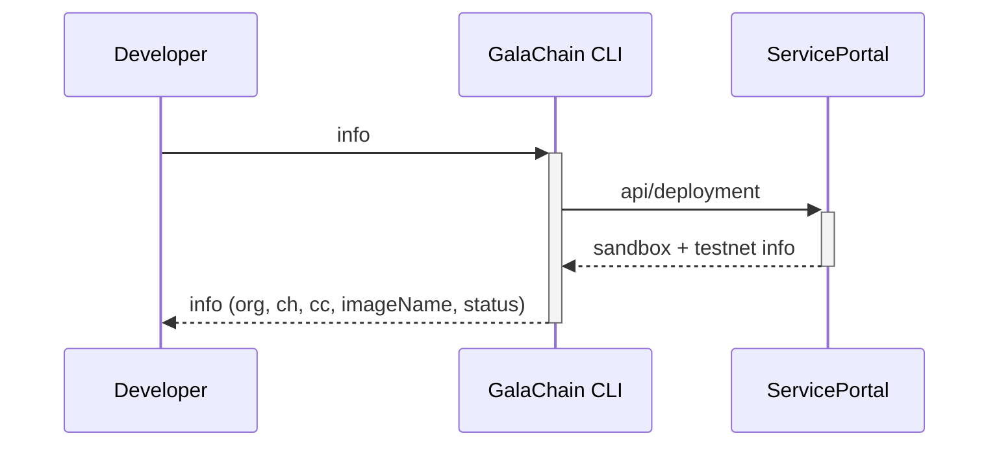
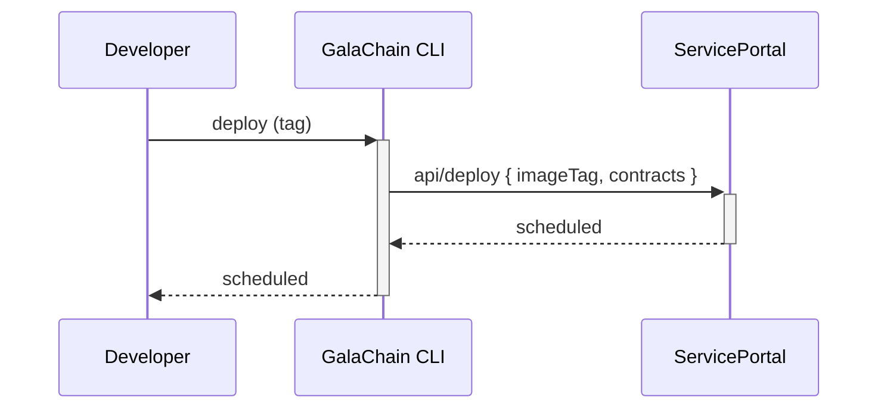

# Chaincode deployment

Chaincode is published as a Docker image to GalaChain repository.
Once the image is published, it can be deployed to GalaChain testnet or sandbox.
In order to publish and deploy chaincode, you need to contact GalaChain support and add provide your secp256k1 public key.

## The process

1. **Build and publish chaincode Docker image.**

    Sample for DockerHub (It uses the [ttl.sh](https://github.com/replicatedhq/ttl.sh) to make it available for 1 day):

    ````shell
    docker build --push -t ttl.sh/<IMAGE_NAME>:1d .
    ````

    Provide us the image name (everything before the `:` character of full docker tag). In the sample above it is the content of `ttl.sh/<IMAGE_NAME>`.

2. **Provide to GalaChain support chaincode information and public keys.**

    The keys are automatically generated when you initialize the project using `galachain init`, so you can find these keys in `keys/gc-admin-key.pub` and `keys/gc-dev-key.pub`.

    > Note: The developer key should be shared with all team members who want to deploy the chaincode.

    If you can't find the keys, you can generate them using the following commands:

    ```shell
    galachain keygen gc-admin-key
    galachain keygen gc-dev-key
    ```

3. **Deploy the chaincode to testnet or sandbox:**
    ```shell
    galachain deploy <docker-image-tag> <path-to>/gc-dev-key
    ```

    > Note: you need to provide docker image name and also the version part. If you used the `ttl.sh` example, the `docker-image-tag` should be something like `ttl.sh/<IMAGE_NAME>:1d`.

4. **Fetch information about the chaincode and deployments:**
    ```shell
    galachain info <path-to>/gc-dev-key
    ```

    Once the status is `CC_DEPLOYED` you can visit the Swagger webpage: [https://gateway-testnet.galachain.com/docs/](https://gateway-testnet.galachain.com/docs/). You can find your chaincode (`gc-<eth-addr>`). If the version is still unknown (and you see `v?.?.?`), it means you may need to wait a couple of minutes till the chaincode is ready.

    Once it is ready, you can use the webpage to call chaincodes. It's good to start `PublicKeyContract/GetPublicKey` with empty object as request body. It should return the admin public key you provided before.

5. **Call the deployed chaincode**

    You can use any REST API client (like `axios` to call your chaincodes). Remember in most cases you will need to sign the DTO with either the `gc-admin-key` or any key of registered user.
   
    We highly recommend to use the `@gala-chain/api` library for handling DTOs and signing. For instance, you can register a user by calling `/api/.../...-PublicKeyContract/RegisterEthUser` and providing the following [`RegisterEthUser`](https://galahackathon.com/latest/chain-api-docs/classes/RegisterEthUserDto/) as payload:

    ```typescript
    const dto = new RegisterEthUser();
    dto.publicKey = <newUserPublicKey>;
    dto.sign(<gc-admin-key>);
    const payloadString = dto.serialize();
    ```
    
    In the current version of the library, local environment exposes slightly different endpoints than the production environment.
    `gcclient` and `@gala-chain/client` packages are compatible with the local environment only.
    For calling the production environment, you should consult the Swagger documentation at [https://gateway-testnet.galachain.com/docs/](https://gateway-testnet.galachain.com/docs/), and use generic REST API client.

## Reference

GalaChain CLI calls some local command and accesses ServicePortal REST API to accomplish certain tasks.
Each REST request body to ServicePortal (1) is signed using our default GalaChain signature type (secp256k1, non-DER), and (2) contains unique request id.
Both signing and creating the ID is managed by GalaChain CLI.

### Fetching information about chaincode and deployments

```
galachain info
```

This command will display:

* Org, channel, chaincode names.
* Status of the chaincode deployment.



### Deploying the chaincode

Deploying to GalaChain testnet:

```
galachain test-deploy <docker-image-tag> <path-to>/gc-dev-key
```

Deploying to GalaChain sandbox:

```
galachain deploy <docker-image-tag> <path-to>/gc-dev-key
```

This command schedules deployment of published chaincode Docker image to GalaChain testnet or sandbox.
In order to get the information about the current status of deployments, you need to use `galachain info` command.


