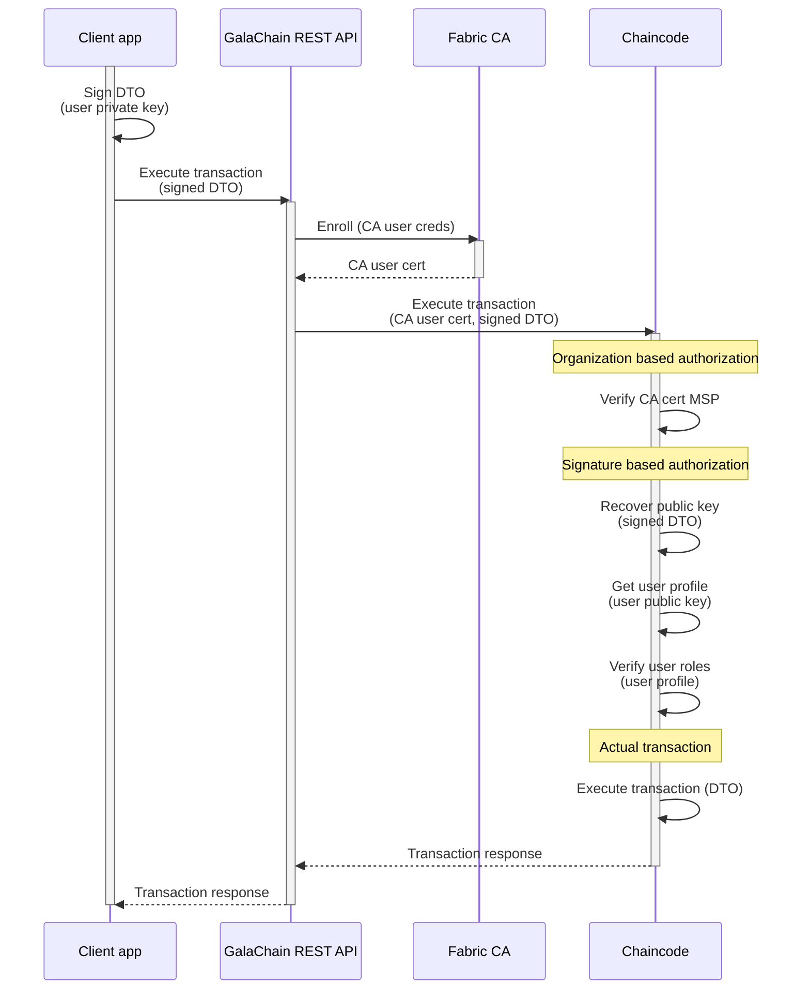

# Authorization and authentication

GalaChain uses two layers of authorization and authentication to ensure that only authorized users can access the system.
The first level, exposed to the client, is based on secp256k1 signatures and private/public key authorization.
The second level uses native Hyperledger Fabric CA users and organizations MSPs.

## How it works

1. Client application signs the transaction with the **end user** private key.
2. GalaChain REST API uses custom **CA user** credentials to call the chaincode.
3. Chaincode checks the MSP of the **CA user** (**Organization based authorization**).
4. Chaincode recovers the **end user** public key from the dto and signature, and verifies if the **end user** is registered (**Signature based authorization**).
5. The transaction is executed if both checks pass.

Note the difference between the **end user** and the **CA user**.
The **end user** is the person who is using the client application, while the **CA user** is the system-level application user that is used to call the chaincode.

In this document, if we refer to the **user**, we mean the **end user**.




## Authentication and Authorization Flow

The authentication and authorization process follows this sequence:

1. **DTO Parsing and Validation**: The incoming DTO is parsed and validated
2. **DTO Expiration Check**: If `dtoExpiresAt` is set, the system checks if the DTO has expired
3. **User Authentication**:
   - If `verifySignature` is enabled or a signature is present, the user is authenticated
   - If no signature verification is required, default roles are assigned based on the authorization type
4. **User Authorization**: The system checks if the authenticated user has the required roles, or organization membership, or is an allowed chaincode
5. **Unique Key Enforcement**: For submit transactions, the system ensures the transaction has a unique key to prevent replay attacks
6. **Transaction Execution**: The actual contract method is executed

### Context Properties

After successful authentication, the following context properties are available:

- `ctx.callingUser`: The user's alias (e.g., `eth|0x123...def`, `client|admin`)
- `ctx.callingUserEthAddress`: The user's Ethereum address (if available)
- `ctx.callingUserRoles`: Array of roles assigned to the user
- `ctx.callingUserProfile`: Complete user profile object
- `ctx.callingUserSignedBy`: Array of user aliases that signed the current transaction
- `ctx.callingUserSignatureQuorum`: Required number of signatures for the user

## Signature based authorization

Signature-based authorization uses secp256k1 signatures to verify the identity of the end user.
It uses the same algorithm as Ethereum (keccak256 + secp256k1).

### Required fields in dto object

The following fields are required in the transaction payload object:
* For regular signature format (r + s + v): `signature` field only.
* For DER signature format: `signature` and `signerPublicKey` fields. 
  The `signerPublicKey` field is required to recover the public key from the signature, since DER signature does not contain the recovery parameter `v`.

Instead of `signerPublicKey` field, you can use `signerAddress` field, which contains the user's checksumed Ethereum address.
The address will be used to get public key of a registered user and use it for signature verification.

### DTO Expiration

DTOs can include an optional `dtoExpiresAt` field to prevent replay attacks and ensure time-sensitive operations:

```typescript
const dto = await createValidDTO(MyDtoClass, {
  myField: "myValue",
  dtoExpiresAt: Date.now() + 300000 // Expires in 5 minutes
}).signed(userPrivateKey);
```

### DTO operation name

Providing explicit operation ID in `dtoOperation` field in DTO is a way to improve security. It prevents from using the DTO as a parameter for a different operation that is was supposed (either by accident or man-in-the middle attack).

The `dtoOperation` name must contain channel, chaincode, and the exact method name as is used by calling the chain (like: `asset-channel_basic-asset_GalaChainToken:TransferToken` or `asset-channel_basic-asset_PublicKeyContract:GetPublicProfile`). It is optional for single signature calls, but required for multisig.

### Signing the transaction payload

Client side it is recommended to use `@gala-chain/api`, or `@gala-chain/cli`, or `@gala-chain/connect` library to sign the transactions.
These libraries will automatically sign the transaction in a way it is compatible with GalaChain.

#### Using `@gala-chain/api`:

```typescript
import { createValidDto } from '@gala-chain/api';
import { ChainCallDTO } from "./dtos";
import { signatures } from "./index";

class MyDtoClass extends ChainCallDTO { ... }

// recommended way to sign the transaction
const dto1 = await createValidDto(MyDtoClass, {myField: "myValue"}).signed(userPrivateKey);

// alternate way, imperative style
const dto2 = new MyDtoClass({myField: "myValue"});
dto2.sign(userPrivateKey);

// when you don't have the dto class, but just a plain object
const dto3 = {myField: "myValue"};
dto3.signature = signatures.getSignature(dto3, Buffer.from(userPrivateKey));
```

#### Using `@gala-chain/cli`:

```bash
galachain dto:sign -o=./output/path.json ./priv-key-file '{ "myField": "myValue" }'
```

#### Using `@gala-chain/connect`:

For the `@gala-chain/connect` library, signing is done automatically when you call the `sendTransaction` method, and it is handled by MetaMask wallet provider.

```typescript
import { GalachainConnectClient } from "@gala-chain/connect";

const client = new GalaChainConnectClient(contractUrl);
await client.connectToMetaMask();

const dto = ...;
const response = await client.send({ method: "TransferToken", payload: dto });
```

#### "Manual" process (ETH):

If you are not using any of the libraries, you can sign the transaction with the following steps:

1. You need to have secp256k1 private key of the end user.
2. Given the transaction payload as JSON object, you need to serialize it to a string in a way that it contains no additional spaces or newlines, fields are sorted alphabetically, and all `BigNumber` values are converted to strings with fixed notation. Also, you need to exclude top-level `signature` and `trace` fields from the payload.
3. You need to hash the serialized payload with keccak256 algorithm (note this is [NOT the same](https://crypto.stackexchange.com/questions/15727/what-are-the-key-differences-between-the-draft-sha-3-standard-and-the-keccak-sub) algorithm as SHA-3).
4. You need to get the signature of the hash using the private key, and add it to the payload as a `signature` field. The signature should be in the format of `rsv` array, where `r` and `s` are 32-byte integers, and `v` is a single byte.

It is important to follow these steps exactly, because chain side the same way of serialization and hashing is used to verify the signature.
If the payload is not serialized and hashed in the same way, the signature will not be verified.

### Authenticating in the chaincode

In the chaincode, before the transaction is executed, GalaChain SDK will recover the public key from the signature and check if the user is registered.
If the user is not registered, the transaction will be rejected with an error.

By default `@Submit` and `@Evaluate` decorators for contract methods enforce signature based authorization.
The `@GalaTransaction` decorator is more flexible and can be used to disable signature based authorization for a specific method.
Disabling signature based authorization is useful when you want to allow anonymous access to a method, but it is not recommended for most use cases.

Chain side `ctx.callingUser` property will be populated with the user's alias, which is either `client|<custom-name>` or `eth|<eth-addr>` (if there is no custom name defined).
Also, `ctx.callingUserEthAddress` will contain the user's Ethereum address, if the user is registered with the Ethereum address.
The `ctx.callingUserRoles` property will contain the user's assigned roles.

This way it is possible to get the current user's properties in the chaincode and use them in the business logic.

### Multisignature users and quorum

Users may register a virtual multisig profile with multiple signers for enhanced security. The required number of signatures (as specified by signatureQuorum) must be provided to authorize a transaction.

#### Registration with Multiple Signers

During registration, you can specify multiple signers using the `signers` field:

```typescript
const { publicKey: pk1, privateKey: sk1 } = signatures.genKeyPair();
const { publicKey: pk2, privateKey: sk2 } = signatures.genKeyPair();

// Register multisig user with signers
// Note: Individual signers do not need to be registered separately
const reg = await createValidSubmitDTO(RegisterUserDto, {
  user: "client|multisig",
  signers: [pk1, pk2].map((k) => asValidUserRef(signatures.getEthAddress(k)),
  signatureQuorum: 2
});
await pkContract.RegisterUser(reg.signed(adminKey));
```

#### Managing Signers

You can add or remove signers from a multisig user:

```typescript
// Add a new signer
const addSignerDto = await createValidSubmitDTO(AddSignerDto, {
  signer: asValidUserRef(signatures.getEthAddress(newPublicKey)),
  dtoOperation: "asset-channel_basic-asset_PublicKeyContract:AddSigner",
  signerAddress: "client|multisig"
}).signed(sk1).signed(sk2); // Requires quorum signatures

await pkContract.AddSigner(addSignerDto);

// Remove a signer
const removeSignerDto = await createValidSubmitDTO(RemoveSignerDto, {
  signer: "eth|" + signatures.getEthAddress(oldPublicKey),
  dtoOperation: "asset-channel_basic-asset_PublicKeyContract:RemoveSigner",
  signerAddress: "client|multisig"
}).signed(sk1).signed(sk2); // Requires quorum signatures

await pkContract.RemoveSigner(removeSignerDto);
```

#### Signing Multisig Transactions

Transactions are signed multiple times, producing a `multisig` array on the DTO:

```typescript
const dto = new GetMyProfileDto({
  dtoOperation: "asset-channel_basic-asset_PublicKeyContract:GetMyProfile",
  dtoExpiresAt: new Date().getTime() + 1000 * 60,
  signerAddress: asValidUserAlias("client|multisig")
});
dto.sign(sk1); // dto.signature = signature1
dto.sign(sk2); // dto.signature = undefined; dto.multisig = [signature1, signature2]
```

Chaincode enforces that any transaction that requires signed DTO is signed by the required number of private keys from the allowed signers list.

#### Multisig Architecture

The new multisig system is based on user aliases rather than raw public keys:

- **Single Signer Users**: Have a single public key and can sign transactions directly
- **Multisig Users**: Have a list of allowed signers (user aliases) and require multiple signatures
- **Signer Management**: Use `AddSigner` and `RemoveSigner` methods to manage the signers list

For multisig transactions the following fields are required in DTO:
- `dtoOperation` - full operation ID on GalaChain (including channel and chaincode)
- `dtoExpiresAt` - Unix timestamp when the operation expires
- `signerAddress` - user alias of the multisig profile

The purpose of `dtoOperation` and `dtoExpiresAt` fields is to enhance security when the DTO of the operation is processed off-chain in signing process.


#### Override Quorum Requirements

You can override the user's signature quorum requirement on a per-transaction basis using the `quorum` option:

```typescript
@Submit({
  in: UpdatePublicKeyDto,
  quorum: 1,  // Override user's quorum requirement
  description: "Updates public key for the calling user."
})
public async UpdatePublicKey(ctx: GalaChainContext, dto: UpdatePublicKeyDto): Promise<void> {
  // This method requires only 1 signature regardless of user's quorum setting
}
```

This feature is supported only for Ethereum signing scheme (secp256k1) with non-DER signatures.

#### Multisig Examples

**Example 1: Corporate Treasury Setup**

```typescript
// Generate keys for signers
const treasuryKeys = Array.from({ length: 5 }, () => signatures.genKeyPair());
const signerRefs = treasuryKeys.map((k) => asValidUserRef(signatures.getEthAddress(k.publicKey)));

// Register corporate treasury with 5 signers requiring 3 signatures
// Note: Individual signers do not need to be registered separately
const treasuryRegistration = await createValidSubmitDTO(RegisterUserDto, {
  user: "client|treasury",
  signers: signerRefs,
  signatureQuorum: 3
});

await pkContract.RegisterUser(treasuryRegistration.signed(adminKey));

// Create a transaction requiring 3 signatures
const transferDto = new TransferTokenDto({
  dtoOperation: "asset-channel_basic-asset_Contract:Transfer", // operation is required for multisig
  signerAddress: "client|treasury", // multisig user address
  dtoExpiresAt: new Date().getTime() + 1000 * 60,
  to: "client|recipient",
  amount: "1000",
  uniqueKey: "transfer-" + Date.now()
});

// Sign with 3 different keys
transferDto
  .signed(treasuryKeys[0].privateKey)
  .signed(treasuryKeys[1].privateKey)
  .signed(treasuryKeys[2].privateKey);

// Execute the transaction
await tokenContract.TransferToken(transferDto);
```

Note that after multiple signing the `transferDto` object contains multiple signatures, so instead of the `signature` field it contains `multisig` field with an array of signatures.

**Example 2: Dynamic Quorum Override**

```typescript
@Submit({
  in: EmergencyActionDto,
  quorum: 1, // Override user's quorum
  description: "Emergency action requiring only 1 signature"
})
async emergencyAction(ctx: GalaChainContext, dto: EmergencyActionDto): Promise<void> {
  // This method only requires 1 signature regardless of user's quorum setting
  
  const signedBy = ctx.callingUserSignedBy;
  ctx.logger.warn(`Emergency action executed by signer: ${signedBy[0]}`);
  
  await executeEmergencyAction(ctx, dto);
}
```

### User registration

GalaChain requires every user to be registered before they can interact with the chaincode.
In order to access the chaincode, the user must be registered with the chaincode.

The primary method to register a user is:

1. `RegisterUser` method in the `PublicKeyContract`.

This method requires the user to provide their public key (secp256k1 for Ethereum, ed25519 for TON) and allows you to specify a custom `alias` parameter.

**Note**: The `RegisterEthUser` and `RegisterTonUser` methods are deprecated and will be removed in a future version. Registration of `eth|` and `ton|` users is no longer required - you can use `RegisterUser` with the appropriate alias format (`eth|<eth-addr>` or `ton|<ton-addr>`) if needed.

Access to registration methods is now controlled as follows:
- **Role-based authorization (RBAC)**: Requires the `REGISTRAR` role
- **Organization-based authorization**: Requires membership in one of the registrar organizations (see [Registrar Organizations and REGISTRAR Role](#registrar-organizations-and-registrar-role))

The authentication mode is controlled by the `USE_RBAC` environment variable:
- `USE_RBAC=true`: Uses role-based authentication
- `USE_RBAC=false` or unset: Uses organization-based authentication

#### Registrar Organizations and REGISTRAR Role

- The set of allowed registrar organizations is controlled by the `REGISTRAR_ORG_MSPS` environment variable (comma-separated list of org MSPs). If not set, it defaults to the value of `CURATOR_ORG_MSP` (default: `CuratorOrg`).
- In RBAC mode, the `REGISTRAR` role is required to register users. This is distinct from the `CURATOR` role, which may be used for other privileged operations.
- In organization-based mode, any CA user from an org listed in `REGISTRAR_ORG_MSPS` can register users.

**Example:**

- To allow both `Org1MSP` and `Org2MSP` to register users, set:
  ```
  REGISTRAR_ORG_MSPS=Org1MSP,Org2MSP
  ```
- If `REGISTRAR_ORG_MSPS` is not set, only the org specified by `CURATOR_ORG_MSP` (default: `CuratorOrg`) can register users.

See the [Registrar Organizations and REGISTRAR Role](#registrar-organizations-and-registrar-role) section for more details.

### Default admin user

When the chaincode is deployed, it contains a default admin end user.
It is provided by two environment variables:
* `DEV_ADMIN_PUBLIC_KEY` - it contains the admin user public key (sample: `88698cb1145865953be1a6dafd9646c3dd4c0ec3955b35d89676242129636a0b`).
* `DEV_ADMIN_USER_ID` - it contains the admin user alias (sample: `client|admin`; this variable is optional),

Alternatively, you can provide a custom admin public key in the contract's configuration:

```typescript
class MyContract extends GalaContract {
  constructor() {
    super("MyContract", version, {
      adminPublicKey: "88698cb1145865953be1a6dafd9646c3dd4c0ec3955b35d89676242129636a0b"
    });
  }
}
```

If the user profile is not found in the chain data, and the public key recovered from the signature is the same as the admin user public key, the admin user is set as the calling user.
Additionally, if the admin user alias is specified (`DEV_ADMIN_USER_ID`), it is used as the calling user alias.
Otherwise, the default admin user alias is  `eth|<eth-addr-from-public-key>`.

The admin user is required to register other users.

For GalaChain TestNet the admin user public key is specified by the `adminPublicKey` registration parameter.

Note the admin uses is an end user, not a CA user, and it cannot bypass the organization based authorization.
If you want to use the admin user to register other users, you need to use the CA user that is registered with the curator organization.

## Organization based authorization

Organization based authorization uses Hyperledger Fabric CA users and organizations MSPs to verify the identity of the caller.
It is used to restrict access to the chaincode method to a specific organization.

You can restrict access to the contract method to a specific organizations by setting the `allowedOrgs` property in the `@GalaTransaction`.

```typescript
@GalaTransaction({
    allowedOrgs: ["SomeRandomOrg"]
})
```

For the `PublicKeyContract` registration methods, the set of allowed organizations is controlled by the `REGISTRAR_ORG_MSPS` environment variable (see [Registrar Organizations and REGISTRAR Role](#registrar-organizations-and-registrar-role)).
If not set, it defaults to `CURATOR_ORG_MSP` (default: `CuratorOrg`).

**Note**: The `allowedOrgs` property is deprecated and will be eventually removed from the chaincode definition.
Instead, you should use the `allowedRoles` property to specify which **roles** can access the method.

## Role Based Access Control (RBAC)

GalaChain SDK v2 introduced a Role Based Access Control (RBAC) system that provides fine-grained control over who can access what resources.

The `allowedOrgs` property is deprecated and will be eventually removed from the chaincode definition.
Instead, you should use the `allowedRoles` property to specify which **roles** can access the method.

The `allowedRoles` property is an array of strings that represent the roles that are allowed to access the method.
The roles are assigned to the `UserProfile` object in the chain data.
By default, the `EVALUATE` and `SUBMIT` roles are assigned to the user when they are registered.
You can assign additional roles to the user using the `PublicKeyContract:UpdateUserRoles` method. This method requires that the calling user either has the `CURATOR` role or is a CA user from a curator organization.

There are some predefined roles (`EVALUATE`, `SUBMIT`, `CURATOR`, `REGISTRAR`). You can also define custom roles for more granular access control.

### Default Role Assignment

When users are registered, they are automatically assigned the following default roles:
- `EVALUATE`: Allows querying the blockchain state
- `SUBMIT`: Allows submitting transactions that modify state

For admin users (when `DEV_ADMIN_PUBLIC_KEY` is set), the following admin roles are assigned:
- `CURATOR`: Allows curator-level operations
- `EVALUATE`: Allows querying the blockchain state  
- `SUBMIT`: Allows submitting transactions that modify state
- `REGISTRAR`: Allows registering new users

For registration methods, the `REGISTRAR` role is required if RBAC is enabled.

### Using Roles in Contract Methods

You can restrict access to contract methods using the `allowedRoles` property:

```typescript
@Submit({
  allowedRoles: ["CURATOR", "REGISTRAR"]
})
async privilegedOperation(ctx: GalaChainContext, dto: OperationDto) {
  // Only users with CURATOR, or REGISTRAR role can execute this
}
```

If no `allowedRoles` is specified, the system defaults to:
- `SUBMIT` role for submit transactions
- `EVALUATE` role for evaluate transactions

## Authenticating a chaincode

GalaChain also supports authorization by a chaincode which is used in cross-chaincode calls.
For instance you can configure your method to allow access where the orgin (entrypoint) chaincode called by the client is `trusted-chaincode`:

```typescript
@GalaTransaction({
  allowedOriginChaincodes: ["trusted-chaincode"]
})
```

In this case, when the origin chaincode is detected as a `trusted-chaincode` no signature-based authorization is performed, and the `ctx.callingUser` property becomes `service|trusted-chaincode`.

Note `allowedOriginChaincodes` property contains **origin** chaincodes not a direct chaincode which calls the current chaincode.
It means the config above supports both calls:

```
trusted-chaincode -> current-chaincode
trusted-chaincode -> other-chaincode -> current-chaincode
```

**Warning**: Do not provide the current chaincode ID in `allowedOriginChaincodes` property.
It effectively means providing open access with no authorization for everyone who provides `service|<current-chaincode>` in `dto.signerAddress`.

### Calling the external chaincode

If you want to call external chaincode and authorize your call as a chaincode:
1. Provide `service|${chaincodeName}` as a `signerAddress` field in the DTO, where the `chaincodeName` is the entrypoint chaincode id, called by the user.
2. Do not sign the DTO.

Remember to allow the chaincode in `allowedOriginChaincodes` transaction property in the target chaincode.

## Optional User Registration

By default, GalaChain requires every user to be registered before they can interact with the chaincode. However, in scenarios with a large number of users, you might want to make user registration optional.

You can allow non-registered users to access the chaincode in one of two ways:

1.  **Environment Variable**: Set the `ALLOW_NON_REGISTERED_USERS` environment variable to `true` for the chaincode container.

    ```bash
    ALLOW_NON_REGISTERED_USERS=true
    ```

2.  **Contract Configuration**: Set the `allowNonRegisteredUsers` property to `true` in your contract's configuration.

    ```typescript
    class MyContract extends GalaContract {
      constructor() {
        super("MyContract", version, {
          allowNonRegisteredUsers: true
        });
      }
    }
    ```

When non-registered users are allowed, they still need to sign the DTO with their private key. The public key is recovered from the signature. In this case, the user's alias will be `eth|<eth-addr>` or `ton|<ton-addr>`, and they will be granted default `EVALUATE` and `SUBMIT` roles.

Registration remains necessary if you need to assign custom aliases or roles to users.
