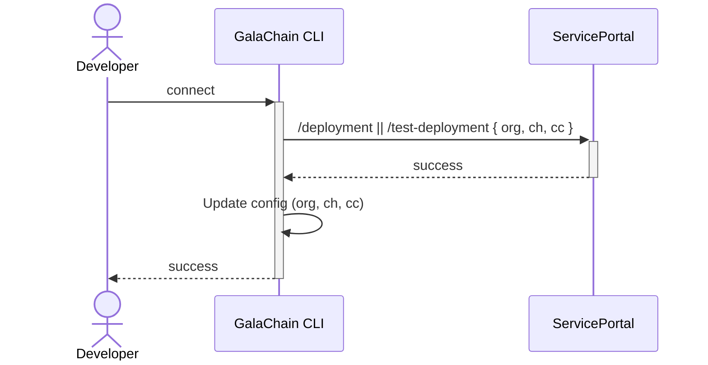
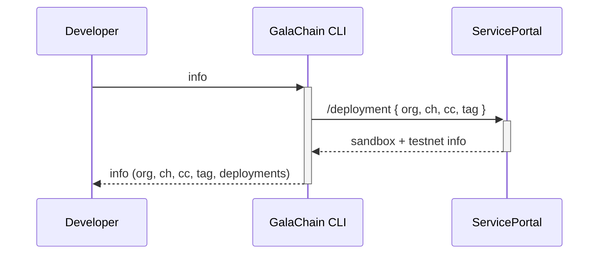
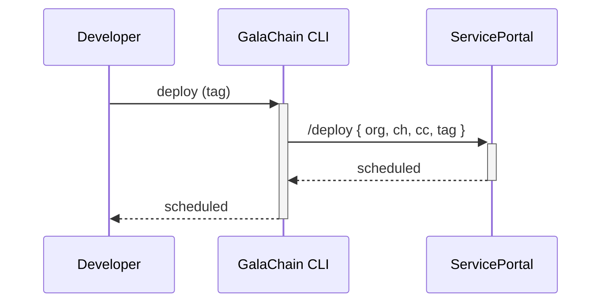

# Chaincode deployment

> **_NOTE:_**  Features described on this page are not yet available in GalaChain CLI.
> This page describes the future functionality and is subject to change.

Chaincode is published as a Docker image to GalaChain repository.
Once the image is published, it can be deployed to GalaChain testnet or sandbox.
In order to publish and deploy chaincode, you need to contact GalaChain support and add provide your secp256k1 public key.

## The process

1. Provide to GalaChain support chaincode information and public keys, then connect the chaincode with:
   ```
   galachain connect
   ```

2. Build and publish chaincode Docker image.

3. Deploy the chaincode to testnet or sandbox:
   ```
   galachain [test-]deploy <image-tag>
   ```

4. Fetch information about the chaincode and deployments:
   ```
   galachain info
   ```

## Reference

GalaChain CLI calls some local command and accesses ServicePortal REST API to accomplish certain tasks.
Each REST request body to ServicePortal (1) is signed using our default GalaChain signature type (secp256k1, non-DER), and (2) contains unique request id.
Both signing and creating the ID is managed by GalaChain CLI.

### Connecting the chaincode

Once you have generated secp256k1 key pair, you should send the following data to GalaChain support:

* Org name
* Channel name
* Chaincode name
* List of secp256k1 public keys that are allowed to deploy a chaincode to testnet
* List of secp256k1 public keys that are allowed to deploy a chaincode to sandbox

This is an off-line process.
Once you send the data, GalaChain support will ask you about some details, to ensure the data is not corrupted.

Tip: you can use `galachain keygen <path>` command to create a valid key pair.

Then you need to call in the chaincode directory:

```
galachain connect <org-name> <channel-name> <chaincode-name>
```

This way GalaChain CLI will verify your public key is authorized to deploy chaincodes, and it will create a configuration file in root project directory (`.galachainrc`) containing org, channel and chaincode names.
This file should be added to your version control system.
Also most of `galachain` commands that manage the chaincode require this file to get information about chaincode metadata.



### Fetching information about chaincode and deployments

```
galachain info
```

This command will display:

* Org, channel, chaincode names (from `.galachainrc` file)
* Tags available for deployment (from `.galachainrc` file)
* Information about deployment to testnet (if applicable)
* Information about deployment to sandbox (if applicable)



### Deploying the chaincode

Deploying to GalaChain testnet:

```
galachain test-deploy <image-tag>
```

Deploying to GalaChain sandbox:

```
galachain deploy <image-tag>
```

This command schedules deployment of published chaincode Docker image to GalaChain testnet or sandbox.
In order to get the information about the current status of deployments, you need to use `galachain info` command.


