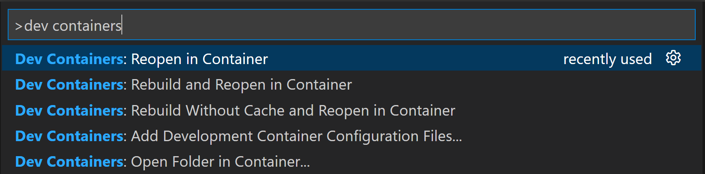

# Getting started

---

## Local Environment (Linux, MacOS, or Windows with WSL)

If you are using Windows with WSL don't forget to enable integration with WSL on Docker Desktop.

### Requirements

You need to have the following tools installed on your machine:
- Node.js 16+
- Docker and Docker Compose
- [jq](https://jqlang.github.io/jq/) and [yq](https://github.com/mikefarah/yq)

### 1. Install our CLI

```
npm i -g @gala-chain/cli
```

Check the CLI:

```
galachain --help
```

### 2. Initialize your project

```
galachain init <project-name>
```

It will create a sample project inside `<project-name>` directory.

Install all dependencies:

```
npm i
```

Build the project:

```
npm run build
```
### 3. Start the network

```
npm run network:start
```

The network will start in hot-reload/watch mode, so leave the prompt with logs running and execute the following commands in a new prompt.

### 4. Run integration tests

Now you can run integration tests with:

```
npm run test:e2e
```

### 5. Verify changes in block browser and GraphQL

Navigate to [http://localhost:3010/blocks](http://localhost:3010/blocks) to see our block browser which allows you to see what's saved on your local GalaChain network.

Navigate to [http://localhost:3010/graphiql](http://localhost:3010/graphiql) to interact with GraphQL and execute queries.


### 6. Next steps

- [Iterate on your chaincode](chaincode-development.md)
- [Get familiar with GalaChain SDK](galachain.md)
- [Deploy chaincode to gc-testnet](chaincode-deployment.md)

---

## Use Docker image (Linux, MacOS or Windows)

### Requirements

- Docker Desktop or Docker CLI.
- [Optional] VS Code with [Dev Containers](https://marketplace.visualstudio.com/items?itemName=ms-vscode-remote.remote-containers) extension.

### 1. Run the Docker image

```
docker run --privileged -d -p 3010:3010 -it --name <container_name> ghcr.io/galachain/sdk:latest
```

Make sure the container is up and running.
The Docker image initializes a new project with the name `chaincode-template` by default.

### 2. Open the running container

#### 2.1 Open the container with bash

```
docker exec -ti <container_name> /bin/bash
```

#### 2.2 Open the container with VSCode (Requires VSCode and Dev Containers Extension)

Open VSCode and press F1 to open the Command Palette and search for `Dev Containers: Attach to Running Container`

After attach the container you may have to open the project folder manually.

### 3. Start the network

Once the terminal is open, start the network with:

```
npm run network:start
```

The network is going to start in dev mode and the prompt will be left showing the logs, so don't close the prompt and open new ones to proceed with the following commands.

### 4. Run integration tests

Now you can run integration tests with:

```
npm run test:e2e
```

### 5. Verify changes in block browser and GraphQL

Navigate to [http://localhost:3010/blocks](http://localhost:3010/blocks) to see our block browser which allows you to see what's saved on your local GalaChain network.

Navigate to [http://localhost:3010/graphiql](http://localhost:3010/graphiql) to interact with GraphQL and execute queries.

---

## Using Dev Containers (Linux or MacOS)

### Requirements

- [VSCode](https://code.visualstudio.com/)
- [Dev Containers Extension](https://marketplace.visualstudio.com/items?itemName=ms-vscode-remote.remote-containers)
- Node.js
- Docker

### 1. Install our CLI

```
npm i -g @gala-games/chain-cli
```

Check the CLI:

```
galachain --help
```

### 2. Initialize your project

```
galachain init <project-name>
```

It will create a sample project inside `<project-name>` directory.

Open the directory on VSCode.

```
cd <project-name>
code .
```

### 3. Open in a Dev Container

While in VSCode, press F1 to open the Command Palette and search for `Dev Containers: Reopen in Container`



You can also click on the Remote Indicator in the status bar to get a list of the most common commands.


### 4. Install dependencies and start network

Open a new prompt when in a Dev Conatiner and run the commands:

```
npm install
```

```
npm run network:start
```

The network will start in dev mode, so leave the prompt with logs running and execute the following commands in a new prompt.

### 5. Run integration tests

Now you can run integration tests with:

```
npm run test:e2e
```

### 6. Verify changes in block browser and GraphQL

Navigate to [http://localhost:3010/blocks](http://localhost:3010/blocks) to see our block browser which allows you to see what's saved on your local GalaChain network.

Navigate to [http://localhost:3010/graphiql](http://localhost:3010/graphiql) to interact with GraphQL and execute queries.

---

# Troubleshooting

## Docker Desktop on Windows

#### If you are using Windows with WSL don't forget to enable integration with WSL on Docker Desktop.
```
Docker Desktop > Settins > Resources > WSL Integration
```

#### Docker: image operating system "linux" cannot be used on this platform: operating system is not supported.

Some versions of the Docker Desktop for Windows have a bug that prevents the use of Linux images. If you are facing this issue, you can use the WSL2 backend to run Docker. To do so, go to Docker Desktop > Settings > General and select WSL2 as the default backend.

#### Docker: "no matching manifest for windows/amd64 in the manifest list entries".

To bypass this issue you can run the Docker daemon in experimental mode:

```
Docker Desktop > Settins > Docker Engine > Edit the Docker daemon file > Set the "experimental": true > Apply & Restart
```

## Docker

#### Docker: Error response from daemon: Conflict. The container name "/<container_name>" is already in use by container "<container_id>". 

You have to remove (or rename) that container to be able to reuse that name.

## WSL

#### ./fablo-target/fabric-config/configtx.yaml: no such file or directory

Make sure you are running it as a administrator of the cmd or powershell.
