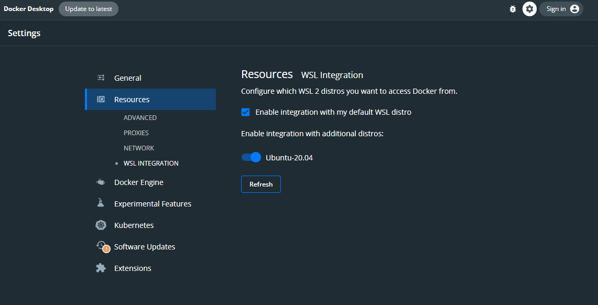

# Using Windows with WSL

## How to use GalaChain with Windows Subsystem for Linux (WSL)

### 1. Install Docker Desktop

Download and install Docker Desktop from the official website: [https://www.docker.com/products/docker-desktop](https://www.docker.com/products/docker-desktop)

**If you already have Docker Desktop installed, make sure to update it to the latest version.**

### 2. Install WSL 2 and a Ubuntu-20.04 distribution

Follow the official guide to install WSL 2: [https://docs.microsoft.com/en-us/windows/wsl/install](https://docs.microsoft.com/en-us/windows/wsl/install)

We reccomend using Ubuntu-20.04 as your distribution. You can install it running the following command on PowerShell:

```powershell
wsl --install -d Ubuntu-20.04
```

Here is a short video from Microsoft about how to install WSL 2 and how to prepare it to build Node.js applications:
<iframe width="560" height="315" src="https://www.youtube.com/embed/lOXatmtBb88?si=tVmp-Jd8Nc-Mm6aS" title="YouTube video player" frameborder="0" allow="accelerometer; autoplay; clipboard-write; encrypted-media; gyroscope; picture-in-picture; web-share" referrerpolicy="strict-origin-when-cross-origin" allowfullscreen></iframe>

### 3. Enable WSL integration on Docker Desktop

Open Docker Desktop and go to `Settings` > `Resources` > `WSL Integration` and enable the integration with your WSL distribution.



### 4. Mount Your Current Windows Directory in WSL (Optional)

If you want to access your Windows file system directly from WSL (e.g., to work with files in your Windows directories like `C:\Users\YourUsername\Documents\`), you can set up WSL to automatically mount your Windows drives.

1. **Edit the WSL Configuration File**:

   Open your `/etc/wsl.conf` file in a text editor. If it doesn’t exist, create it:

   ```bash
   sudo nano /etc/wsl.conf
   ```

2. **Add the Following Configuration**:

   Add these lines to the file:

   ```ini
   [boot]
   systemd=true

   [automount]
   enabled=true
   root=/mnt/
   options="metadata,umask=22,fmask=11"
   ```

   - **`metadata`**: Enables the storage of Linux file system metadata (such as permissions and symbolic links) on the mounted Windows drives.
   - **`umask=22`**: Sets the default permission of new directories to `0755` and files to `0644`.
   - **`fmask=11`**: Sets the default permission of new files to `0666`, ensuring they are not executable by default.

3. **Restart WSL**:

   After saving the changes, restart your WSL environment:

   ```bash
   wsl --shutdown
   ```

   Start WSL again, and your Windows drives should be mounted under `/mnt/`, for example, `/mnt/c` for the `C:` drive.

4. **Access Your Windows Directories**:

   Now you can navigate to your Windows directories from within WSL, like this:

   ```bash
   cd /mnt/c/Users/YourUsername/Documents/MyFolder
   ```
   
### 4. Install dependencies and start network

1. Use the [WSL extension on VSCode](https://marketplace.visualstudio.com/items?itemName=ms-vscode-remote.remote-wsl) to connect to your WSL distribution.
2. Install Node Version Manager (NVM) on your WSL distribution: https://learn.microsoft.com/en-us/windows/dev-environment/javascript/nodejs-on-wsl#install-nvm-nodejs-and-npm
3. Install `yq` and `jq` on your WSL distribution:
    ```bash
    sudo snap install yq jq
    ```
4. At this point your WSL environment should be ready to use GalaChain. Follow the instructions on the [Getting Started](./getting-started.md) guide to install the CLI and initialize your project.

